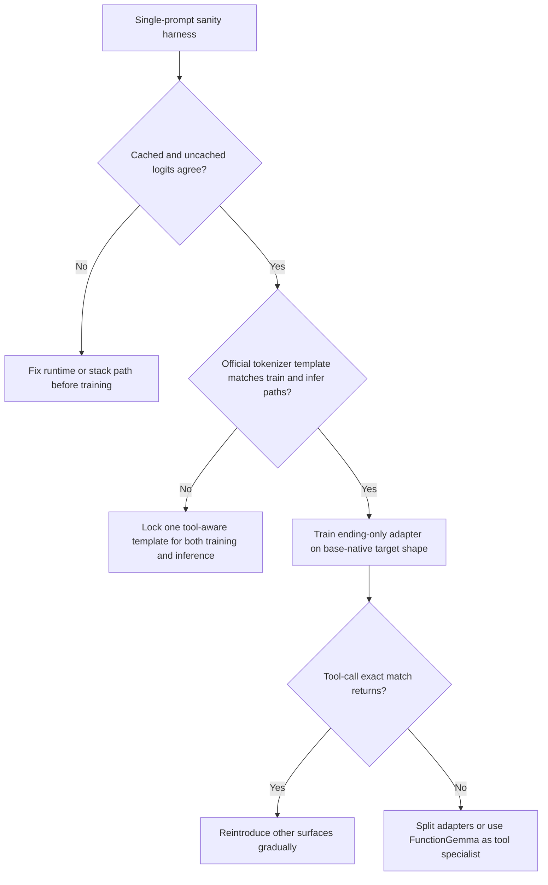

# Deep Research on the Gemma 4 E2B Tool-Calling LoRA Failure

## Executive summary

Your uploaded brief describes a very specific failure pattern: a single LoRA on `unsloth/gemma-4-E2B-it` is being trained across three output surfaces, but the `check_in_ending` surface collapses into a single canned closing line, drops the `endConversation(...)` call entirely, and does so even though the untuned base model reportedly emits the desired end-call pattern reliably under your preserved chat-template path. The same brief also shows that the ending surface is the minority task globally, is outnumbered by non-tool `check_in_intermediate` within the check-in family, and uses only five repeated closing speeches across 240 unique ending examples. fileciteturn0file0

The highest-confidence conclusion from the public evidence is that this is **not primarily a “try a different learning rate” problem**. The most plausible failure sources are, in descending order: **template/runtime drift**, **incompatible first-token regimes inside one adapter**, **shortcut learning caused by repeated natural-language endings and class imbalance**, and **fragile response-only masking on serialized assistant/tool spans**. Those risks are all publicly documented in adjacent Gemma 4, FunctionGemma, Transformers, Unsloth, and TRL materials. citeturn21search1turn20view2turn31view0turn15view2turn16view1turn28view2turn24view2

The strongest public, reproducible on-device function-calling recipe in the Gemma ecosystem is **not** a Gemma 4 E2B LoRA recipe. It is Google’s **FunctionGemma 270M** workflow: a Gemma 3–based, function-specialized small model with official fine-tuning docs, a no-code Tuning Lab, a public Mobile Actions dataset, an official mobile deployment path, and reported improvements from **58% to 85%** on the Mobile Actions evaluation, plus on-device measurements on a Samsung S25 Ultra. That makes FunctionGemma the most credible public “tool-call expert” option if your product can tolerate a split architecture. citeturn12view0turn5view1turn11view0turn9search0

My bottom-line recommendation is to treat this as a **format-and-task-separation problem first**, not an optimizer problem. The fastest path is: verify template parity and cached/uncached logits, train an **ending-only adapter** with the base-native output shape until first-token tool emission is stable, then reintroduce the other surfaces only if that specialist adapter works. If you cannot get ending-only LoRA to preserve the tool line, I would stop pushing one adapter across all surfaces and move to either **separate adapters** or a **FunctionGemma specialist + Gemma 4/general-response model** split. citeturn31view0turn37view4turn37view1turn12view0turn5view1

## What the uploaded brief establishes

The uploaded brief gives enough structure to rule out several superficial explanations. You are not describing random generation drift; you are describing **surface-specific collapse** on a minority tool-emission task inside a mixed-output LoRA. The adapter is being asked to do all of the following: start some outputs with a tool call plus closing speech, start some with plain conversational text, and start others with structured JSON. The failure is concentrated on the `check_in_ending` surface, where post-train outputs converge to the same short natural-language response regardless of the correct `cravingScore`, `obstacleCategory`, or dialogue history. fileciteturn0file0

Two details from the brief matter especially. First, the collapsed string is **not** a verbatim training target; it is a paraphrastic blend of frequent closing-language fragments and prompt language. Second, the ending surface has only **five** repeated closing speeches across **240** unique ending rows, while ending is only **15.1%** of the full dataset and is outnumbered within check-in rows by non-tool intermediate examples. That combination is exactly the kind of setup where cross-entropy SFT can prefer a high-probability natural-language shortcut over a lower-entropy structured lead-in. That point is an inference from your data, but it is consistent with published work showing that standard CE-style SFT narrows output diversity and can over-reward common modes. fileciteturn0file0 citeturn24view0turn28view2turn28view3

Your brief also makes the chat-template question central rather than incidental. You explicitly report that the base model works when you preserve the tokenizer’s template path and that Unsloth’s bundled `get_chat_template(..., chat_template="gemma-4")` path appears to ignore `tools=`. That suspicion is well-founded in the public artifacts reviewed below. fileciteturn0file0 citeturn20view2turn19view0turn19view1

## What the strongest public evidence says

Google’s official function-calling specialization path is **FunctionGemma**, not a Gemma 4 E2B fine-tuning notebook. Google describes FunctionGemma as a specialized version of Gemma 3 270M “designed as a strong base for further training” into local function-calling agents, explicitly notes that it is **not intended for use as a direct dialogue model**, and says it uses a **different chat format** from the base Gemma 3 family. The model card also states that fine-tuning on the official Mobile Actions recipe improved eval results from **58%** for the base FunctionGemma model to **85%** for the specialized Mobile Actions fine-tune. citeturn12view0turn5view2

That FunctionGemma path is unusually concrete by public standards. Google publishes a Mobile Actions tutorial, a Mobile Actions dataset, a Tuning Lab Space, and an official fine-tuning guide that uses TRL `SFTTrainer`. In Google’s walkthrough, the example configuration uses `learning_rate=5e-5`, `num_train_epochs=8`, `per_device_train_batch_size=4`, `max_length=512`, no gradient checkpointing, and epoch evaluation; the Tuning Lab implementation also uses TRL with `per_device_train_batch_size=4`, `max_length=512`, `eval_strategy="epoch"`, `save_strategy="no"`, and lets the user vary epochs and learning rate. Google also publishes an end-to-end deployment path to LiteRT-LM / AI Edge Gallery for on-device use. citeturn6view1turn6view2turn11view0turn9search0turn5view1turn5view4

By contrast, the current public **Gemma 4** material is stronger on **inference protocol** than on **function-calling fine-tuning recipes**. Google’s Gemma 4 function-calling guide shows the expected message structure in the Hugging Face ecosystem: assistant turns carry `tool_calls`, tool results are appended in `tool_responses`, and `apply_chat_template()` is used to serialize the conversation into the model’s required token structure. Hugging Face’s generic tool-use documentation likewise recommends carrying tool calls as dicts in the assistant message and warns that OpenAI-style JSON-string tool calls can produce strange behavior in Transformers-based workflows. citeturn13view3turn13view4turn15view1turn15view3

I did find public small-Gemma function-calling artifacts beyond FunctionGemma, but they are weaker. A Google Cloud partnership adapter for `gemma-2-2b-it-function_calling` exists, yet its public model card reports mainly **validation loss** and basic training metadata rather than the sort of exact-match tool-calling evaluation you need here. In other words, there are public examples of small Gemma adapters for function calling, but the only high-confidence, on-device, officially evaluated recipe I found is still the FunctionGemma / Mobile Actions line. citeturn27search0turn12view0turn5view1

## What most likely broke in this run

The first likely break is **template drift**. The current official `google/gemma-4-E2B-it` tokenizer template on Hugging Face visibly includes tool declarations plus serialized `tool_calls` and `tool_responses`. Unsloth’s **model-level** Gemma 4 template on Hugging Face also includes these blocks. But Unsloth’s bundled `chat_template="gemma-4"` implementation in `unsloth/chat_templates.py` appears to be a much simpler renderer that does not include any tool-definition or tool-call serialization logic in the visible snippet. That means your suspicion is supported by public source evidence: one Unsloth Gemma 4 path is tool-aware, another appears not to be. If you trained or evaluated through the wrong one, you would create immediate train/infer distribution drift. citeturn21search1turn19view0turn19view1turn19view2turn20view2turn20view3

That matters even more because Unsloth’s own current Gemma 4 docs explicitly warn that if an exported model behaves worse in another runtime, the “most common cause” is the **wrong chat template / EOS token** at inference time, and those docs say you must use the **same chat template you trained with**. The same page also says Gemma 4 data should be in standard `system` / `user` / `assistant` chat roles and stresses keeping formatting consistent. citeturn37view4turn37view1

The second likely break is the **Gemma 4 training-path bug surface** around `use_cache=False`. A public Transformers issue from April 2026 documented that for Gemma 4, `use_cache=False` could corrupt attention computation, produce garbage logits, and drive training loss into the **~10–15** range; the issue text specifically says that common QLoRA/LoRA workflows that disable cache can break Gemma 4, and that generation may still look okay because `generate()` uses `use_cache=True`. Unsloth’s April 2026 Gemma 4 announcement separately says Gemma 4 training and quantization had “many fixes,” specifically calling out exploding-loss behavior from gradient accumulation and the `use_cache=False` bug, while its current docs advise updating Unsloth and using Unsloth’s own gradient-checkpointing path. citeturn31view0turn18view1turn36view2turn36view0turn32search8

Because your aggregate loss reportedly fell from roughly **12 to 1.5**, I do **not** think you are in the fully broken near-random regime described in that issue. But I also would not trust aggregate loss as evidence that the tool surface is healthy. The public bug evidence is still important because it means Gemma 4 training has had **real stack-sensitive failure modes**, and a good-looking global loss can coexist with the wrong serialization path or the wrong surface winning the gradients. fileciteturn0file0 citeturn31view0turn18view1

The third likely break is **masking fragility**. TRL’s documented `assistant_only_loss=True` behavior only works when the chat template returns an assistant-token mask via `` markers, and TRL now ships **patched training templates** for Gemma/Gemma 3 because the default templates otherwise include prompt cues in the assistant span. Hugging Face’s tool-use docs also make clear that assistant messages can contain structured tool calls, and model cards determine the exact serialization expected. That means your concern about `train_on_responses_only` over multi-message turns is real: if your mask is based on string delimiters like `<|turn>user\n` and `<|turn>model\n`, it may not understand whether serialized tool blocks live inside the assistant span, whether synthetic tool responses are masked, or whether the natural-language closing gets more credit than the structured prefix. citeturn15view2turn16view1turn16view2turn15view1turn13view4

The fourth likely break is **task geometry inside one adapter**. Your single LoRA is being asked to learn at least three incompatible “opening token” regimes: natural-language conversation, structured JSON-first generations, and tool-call-first generations with a follow-on closing. Published work does not give a Gemma-4-specific theorem for that exact setup, but it does say two relevant things. First, standard CE-based SFT tends to reduce output diversity relative to the pre-trained model; in one ICLR 2025 study, CE-fine-tuning reduced measured diversity compared with the pre-trained model, and the paper explicitly frames standard SFT as pushing toward more concentrated output modes. Second, ACL 2024 work on SFT data composition shows that the **mixture** of tasks in supervision affects which abilities are preserved or strengthened. Combined with your heavily repeated ending language and minority structured-tool surface, the simplest explanation is that the adapter found an easier global optimum: emit a safe closing-style sentence and stop. citeturn24view0turn28view2turn29view0turn24view2

## Recommended path forward

I would debug this in the following order because each step isolates a different class of failure and avoids wasting more GPU time on a structurally ambiguous objective. The flow below is derived directly from the public Gemma 4 template evidence, the documented Gemma 4 training bug, and TRL’s masking constraints. citeturn21search1turn20view2turn31view0turn15view2turn37view4

The highest-priority experiment is a **parity harness**, not another sweep. On a single ending row, compare: rendered text, token IDs, assistant mask, and first-step logits under **your current preserved tokenizer template**, **Unsloth’s bundled `gemma-4` template**, and the **current official `google/gemma-4-E2B-it` template**. In the same harness, compare `use_cache=True` vs `use_cache=False` (or the exact forward path Unsloth actually calls in training). If any of those disagree, stop training and fix that first. Expected effect size: **very large**. Time cost: **hours, not days**. citeturn21search1turn20view2turn19view0turn19view1turn31view0

The next experiment should be an **ending-only specialist adapter** trained on the **base-native target shape** you already know works in probing. Do not mix JSON surfaces. Do not mix intermediate check-ins. Do not use the synthetic tool-response variant until the single-turn ending-only target works. Your goal is not “better loss”; it is restoring exact first-token tool emission on held-out ending rows. Expected effect size: **very large** if the core issue is task interference rather than impossible capacity. Time cost: **about one day**. This recommendation is also consistent with Google’s public ecosystem design, which uses FunctionGemma as a specialized function-calling base rather than trying to make one tiny model do every surface equally well. fileciteturn0file0 citeturn12view0turn5view0turn5view1

Only after that would I try a **curriculum or split-adapter strategy**. If the ending-only adapter works, reintroduce the other surfaces gradually: first ending + intermediate, then add one JSON surface, then the other. If performance regresses sharply when you reintroduce JSON-first tasks, that is a strong signal that one adapter is the wrong abstraction. At that point I would prefer **separate adapters** or a lightweight inference router over ever more elaborate balancing heuristics. Expected effect size: **high**. Time cost: **one to several days**. citeturn24view2turn28view2turn37view1

I would also run a dedicated **mask audit** on one v4/v5-style example and one v6-style example. You need to know which assistant tokens receive loss, exactly where tool-serialized spans begin and end, and whether the loss mask is rewarding the closing speech far more strongly than the tool-call prefix. TRL’s newer docs make clear that this is template-sensitive and that assistant-only loss needs generation markers; your stack version makes that concern more urgent, not less. Expected effect size: **medium to high** because it can invalidate several past runs in one shot. Time cost: **less than one day**. citeturn15view2turn16view1turn16view2

If your product architecture allows it, the strongest public alternative is to **separate tool calling from the rest of the language behavior**. FunctionGemma is explicitly intended for fine-tuning into local function-calling specialists, and Google has already shown the Mobile Actions path working end to end on-device with LiteRT-LM. The trade-off is orchestration: FunctionGemma is not a direct dialogue model and uses a different chat format, so you would likely use it as a tool-call expert while keeping Gemma 4 or your existing v3 adapter for narration/reflection/closing behavior. Expected effect size: **medium to high** if the real bottleneck is one-adapter interference. Time cost: **several days plus integration work**. citeturn12view0turn5view1turn5view4

I would **not** start with DPO/RPO, prefix tuning, or exotic anti-collapse losses. The literature on SFT diversity is interesting and real, but your first-order public evidence points to a more ordinary failure stack: wrong or drifting template, possibly brittle masking, and a dataset where the easiest winning behavior is a natural-language closing rather than a structured tool preamble. Preference tuning is more appropriate **after** you have a plain SFT model that already emits the right tool prefix and only needs preference shaping. citeturn24view1turn28view2turn31view0turn37view4

## What to measure instead of aggregate loss

A healthy run for this task should be judged with **surface-specific token metrics**, not just overall train loss. The public FunctionGemma tooling itself emphasizes both training loss and **task success rate** on evaluation, and the Gemma 4 bug report shows that diagnostic logits on specific prompts can be more informative than training loss alone. citeturn9search0turn11view0turn31view0

For your case, I would track at least these five signals on a held-out ending set:

- **Tool-call present rate**: percentage of ending rows whose very first generated span begins with the correct `endConversation` call shape.  
- **Argument exact match**: exact accuracy for `cravingScore` and `obstacleCategory`.  
- **Illegal no-tool rate**: percentage of ending rows that emit only conversational text.  
- **False-positive tool rate on intermediate rows**: the other side of the boundary.  
- **Speech diversity after correct tool emission**: once tool emission is restored, measure whether the closing sentence degenerates into one variant anyway.  

Those metrics line up much more closely with the actual product failure you described than “loss reached 1.5.” fileciteturn0file0 citeturn31view0turn28view2

## Open questions and limitations

I did **not** find a primary-source, official **Gemma 4 E2B function-calling fine-tuning** recipe with the same level of detail and evaluation that Google provides for FunctionGemma. The strongest official Gemma 4 materials are on inference formatting and generic Gemma fine-tuning, while the strongest official function-calling fine-tuning materials are for FunctionGemma. citeturn27search3turn33view1turn12view0turn5view1

I also did **not** find a primary-source published target like “healthy Gemma 4 E2B tool-calling LoRA runs should end near loss X.” The best public guidance I found is negative rather than positive: losses in the **10–15** range are a warning sign for broken Gemma 4 training paths, while steadily decreasing loss alone is not enough to prove task correctness. citeturn31view0turn34view3

The final unresolved question is whether your observation that the base model emits only literal `endConversation{...}` text, with no visible tool special-token IDs, reflects an older tokenizer/runtime path, a decode artifact, or a genuine distributional difference in the specific stack you are using. The current public Gemma 4 template artifacts are clearly tool-aware. That is why the first recommendation above is a parity harness rather than more training: until you resolve that mismatch, every downstream interpretation stays less certain than it needs to be. citeturn21search1turn13view4turn20view2