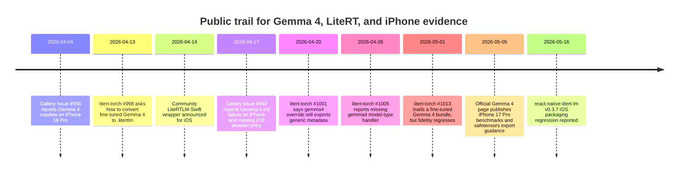

# Public Evidence for Fine-Tuned Gemma 4 on Physical iPhone via LiteRT

## Executive summary

I reviewed Google’s official Gemma, LiteRT-LM, MediaPipe, and AI Edge Gallery documentation; GitHub repos and issues for `google-ai-edge/LiteRT-LM`, `google-ai-edge/litert-torch`, `google-ai-edge/gallery`, and `hung-yueh/react-native-litert-lm`; Hugging Face discussions around `litert-community/gemma-4-E2B-it-litert-lm`; and community iOS wrapper projects and blog posts. My bottom-line finding is **negative**: I did **not** find a public, citation-strong case that simultaneously proves a **fine-tuned** Gemma 4 E2B/E4B, running on a **physical iPhone**, through a **LiteRT-based runtime**, with an adequately disclosed **conversion/export pipeline** and **runtime/builder version pairing**. Official Google sources prove that **stock** Gemma 4 E2B/E4B runs on iPhone 17 Pro through LiteRT-LM, and they also document how to export **custom safetensors** to `.litertlm`; but those sources stop short of documenting a **fine-tuned Gemma 4** actually running on a physical iPhone. The closest public fine-tuned artifact is a `litert-torch` issue where a LoRA-tuned Gemma 4 E2B tool-calling model is exported and loaded by `litert-lm`, but on macOS rather than iPhone, and with major behavior regressions after conversion. At the same time, public bug reports show late-April Gemma 4 metadata bugs in the exporter and early-April iPhone 16 Pro failures for stock Gemma 4 on iOS. citeturn16view0turn21view0turn46view0turn46view1turn24view1turn24view2

The narrower statement that *is* well-supported is this: **stock Gemma 4 on physical iPhone via LiteRT-LM is real**, and **fine-tuned Gemma 4 to `.litertlm` export is also real**. What I could not find is a public artifact that cleanly joins those two halves into one reproducible, versioned, fine-tuned-on-iPhone story. Community wrappers such as LiteRTLM-Swift, `flutter_gemma`, and React Native forks make that bridge technically plausible, but the public artifacts I found are either stock-model validations, simulator-only probes, build recipes without a demonstrated fine-tuned iPhone run, or negative reports of iOS/runtime breakage. citeturn44view0turn45view0turn45view2turn34view0turn6view5turn38view4

## How I judged the evidence

I only counted a result as a true “success story” if the source explicitly established all four of these facts: the model was **fine-tuned** rather than stock; the run was on a **physical iPhone** rather than a simulator; the runtime was a **LiteRT-derived stack** such as LiteRT-LM, MediaPipe LLM Inference, LiteRT C/C++, or an explicit iOS XCFramework/fork based on those runtimes; and the source disclosed enough about the **conversion path** and **version pairing** to make the claim technically meaningful. Generic “works on iOS” statements, simulator-only projects, or stock `litert-community/gemma-4-E2B-it-litert-lm` demos were treated as partial matches, not hits. That standard matters because the official platform story is still split: LiteRT-LM is the current direction for iOS, Swift APIs are still described as “coming soon,” and the older MediaPipe mobile LLM Inference API is now deprecated for Android and iOS. citeturn37search13turn9view1turn9view2

The timeline below captures why the public record still feels transitional. Fine-tuned-export demand appears in mid-April threads, Gemma 4 iOS failures show up publicly in early and mid-April, Gemma 4 metadata bugs are reported in late April, a fine-tuned `.litertlm` load appears on May 1, and Google’s official Gemma 4 page adds iPhone 17 Pro benchmarks and custom-safetensors export guidance on May 5. citeturn24view2turn22view1turn24view1turn46view1turn46view0turn21view0turn16view0

## Closest public matches to the target

The strongest **official** iPhone proof is Google’s Gemma 4 page in the LiteRT-LM docs. That page says LiteRT-LM currently supports Gemma 4 E2B and E4B, provides a **custom-safetensors** deployment recipe using `litert-torch-nightly`, and publishes performance figures for **iPhone 17 Pro** on both CPU and GPU for stock Gemma 4 E2B and E4B. But it does **not** say those iPhone benchmarks were run with a fine-tuned model; the benchmarked artifacts are plainly the official pre-exported Gemma 4 LiteRT-LM models. In other words, Google publicly proves “stock Gemma 4 on physical iPhone via LiteRT-LM,” and separately documents “how to export a custom Gemma 4 safetensors checkpoint,” but does not publicly publish the combined claim the user asked for. citeturn16view0

The best **community** physical-iPhone proof I found is LiteRT-LM issue #1906, where a developer says they implemented a complete Swift binding for LiteRT-LM and validated it on **iPhone 17 Pro Max (CPU)** with **Gemma 4 E2B-IT** and Gemma 3 1B. That issue is still about a **stock** model, not a fine-tune, but it is explicit about the physical device and the model family. The companion `LiteRTLM-Swift` repo adds valuable build details: it wraps the LiteRT-LM C API, requires iOS 17+, documents the `increased-memory-limit` entitlement, and explains how to build an XCFramework by patching LiteRT-LM `v0.10.2` or newer source, including a workaround for the missing `ios_engine.bzl` file on HEAD. This is exactly the kind of **iOS build recipe** the user asked for, but it still stops short of a public fine-tuned Gemma 4 iPhone deployment. citeturn44view0turn6view2turn45view0turn45view2

There are also weaker but still relevant stock-model iPhone confirmations. A DEV post explicitly claims “Gemma 4” was run locally on an **iPhone 13 Pro** using the Swift wrapper; a separate blog post by Rob Hoeijmakers describes stock Gemma 4 E2B/E4B running on an **iPhone 16 Pro** through consumer apps such as AI Edge Gallery and AI Locally. These are useful as **physical-iPhone plausibility checks**, but neither is a versioned, fine-tuned, reproducible LiteRT deployment dossier. citeturn32view0turn32view1

Cross-platform wrappers strengthen the same partial conclusion. `flutter_gemma` now says its 0.15 line adds **Gemma 4 MTP via LiteRT-LM 0.11.0**, that `.litertlm` on iOS runs through an **FFI engine** with vision/audio on **physical devices**, and that Gemma 4 uses a separate `ModelType.gemma4`. The RN fork `zkproofport/rn-litert-gemma4` is even more explicit about iOS mechanics: it is a hard fork of `react-native-litert-lm` v0.3.6, declares **LiteRT-LM Engine 0.10.2**, says Gemma 4 E2B-sized models require Apple’s **Extended Virtual Addressing** entitlement on physical devices, and ships a Bazel-to-XCFramework pipeline that clones LiteRT-LM `v0.10.2`, applies `ios-engine-fixes.patch`, merges roughly **1,909** object files, and emits `LiteRTLM.xcframework`. Again, these are strong runtime and build signals, but I did not find a public artifact showing a **fine-tuned Gemma 4 E2B/E4B** actually running on a physical iPhone through either wrapper. citeturn34view0turn4view0turn38view4turn38view5

One false positive I explicitly excluded is `johnvouros/gemma4-ios-probe`. Its README is clear that the app is **simulator-first** and that device/TestFlight signing is intentionally out of scope. Because the user asked for **physical iPhone** evidence, it cannot count. Another repo, `adityaanilraut/gemma4-litert-mobile/ios`, is useful as a **how-to sketch** for bundling `.litertlm` into an iOS app, but it is instructions, not a demonstrated run. citeturn6view5turn6view4

## Fine-tuned export evidence and what it actually proves

Google’s own documentation now makes clear that fine-tuned Gemma 4 **should** be exportable into the LiteRT ecosystem. The official Gemma 4 LiteRT-LM page tells developers to start from their **custom safetensors**, use `litert-torch-nightly export_hf`, and deploy the resulting `.litertlm` with LiteRT-LM. The separate MediaPipe conversion guide says `.task` packages can be built from **pre-trained or fine-tuned Gemma** checkpoints for Android and iOS. That means the idea itself is not speculative: Google’s tooling story explicitly intends to support fine-tuned Gemma on-device. citeturn16view0turn9view0

The strongest public evidence that this export path works for **fine-tuned Gemma 4 specifically** is `google-ai-edge/litert-torch` issue #1013. The reporter says a **LoRA-fine-tuned Gemma 4 E2B tool-calling model** could be fused into an HF/safetensors directory, exported via `litert_torch.generative.export_hf.export(...)`, bundled as `.litertlm`, and loaded by `litert-lm`. Importantly, the report is unusually specific about versions: host macOS 26.4.1 arm64, Python 3.12.13, `litert-torch` **0.10.0** at commit `44d606e007745faf6007e438fccfe657f9af05d7`, `ai-edge-litert-nightly` **2.2.0.dev20260427**, and `litert-lm` **0.10.1**. It also describes the compatibility shims used before export, including remapping MLX-fused weight keys, adding `lm_head.weight`, and rewriting unsupported `.get(...)` calls in the Jinja chat template. That is exactly the kind of detail the user asked for. But the run was on macOS, not iPhone, and post-conversion quality degraded badly: the reporter says behavior accuracy dropped from **144/144** in the MLX baseline to **53/144** through LiteRT-LM, with malformed tool calls and broken confirmation/refusal behavior. citeturn21view0

The Hugging Face side tells a similar story of demand without closure. On the `litert-community/gemma-4-E2B-it-litert-lm` discussion board, thread **#15** asks how to convert a **fine-tuned multimodal** Gemma 4 E2B-it model into LiteRT-LM while preserving multimodality; thread **#14** asks for the parameters and quantization used to make the official Gemma 4 LiteRT-LM model from a merged fine-tuned checkpoint; thread **#7** asks how the original Gemma 4 model was converted and explicitly says the goal is to fine-tune and then deploy on-device. The model page itself still says there are **no code snippets available yet** for the LiteRT-LM library. Taken together, those threads are strong evidence of community need and documentation gaps, but not of a documented physical-iPhone success. citeturn10view0turn10view1turn10view2

The MediaPipe `.task` path is real, but it is a narrowing path rather than the center of gravity. Google’s MediaPipe conversion guide says fine-tuned Gemma checkpoints can be packed into `.task` bundles for Android and iOS, but it also says the LiteRT Torch generative converter is **CPU-only**, and the top-level MediaPipe LLM Inference docs now mark the Android and iOS implementations as **deprecated** and recommend migration to LiteRT-LM. Those same docs also note that LoRA is supported for the LLM Inference API, but **not** with models converted through the LiteRT Torch Generative API. In practice, that makes MediaPipe useful for understanding the conversion chain, but less convincing as a forward-looking answer for a fine-tuned Gemma 4 iPhone deployment. citeturn9view0turn9view1turn9view2

## Blockers and ecosystem gaps that explain the missing public hit

The most important public obstacle is the **Gemma 4 metadata path in `litert-torch`**. Issue **#1005** says `build_llm_metadata()` lacked a `case 'gemma4'`, so Gemma 4 exports fell through to `generic_model` metadata. The reporter says that leads LiteRT-LM to use `GenericDataProcessor` instead of `Gemma4DataProcessor`, which in turn breaks Gemma 4’s Jinja chat template semantics and likely inference orchestration. Issue **#1001** adds that even `litert_lm_model_type_override="gemma4"` still exported the model as generic. These bugs matter because they strike the exact place where a fine-tuned Gemma 4 would need correct packaging to preserve chat formatting and tool-call behavior. citeturn46view0turn46view1

I think those metadata bugs are a plausible contributor to the behavior failures in issue **#1013**, although the public record does not prove causality. The timing lines up: the late-April bugs say Gemma 4 exports can be mislabeled as `generic_model`, and the May 1 fine-tuned tool-calling report says LiteRT-LM often emits malformed tool calls, repeated fragments, and broken confirmation/refusal patterns after conversion. That is an inference, not a demonstrated root-cause statement, but it is technically coherent. citeturn46view0turn46view1turn21view0

The iPhone runtime side also had visible instability in April. Gallery issue **#556** reports that the Google AI Edge Gallery app crashed when trying to run **Gemma-4-E2B-it** on an **iPhone 16 Pro**. Gallery issue **#692** is even more specific: a developer bundling the official `gemma-4-E2B-it.litertlm` into an offline iOS app says LiteRT-LM failed before producing a response on an **iPhone 16 Pro**, logging dynamic tensor allocation failures; the same issue also notes that the public Gallery iOS allowlist lacked Gemma 4 while the Android allowlist included it. That does not mean iPhone support never worked—Google’s May 5 Gemma 4 page clearly shows it did on iPhone 17 Pro—but it does show why there is no clean body of public iPhone evidence from early April. citeturn24view2turn24view1turn16view0

Community iOS build recipes also reveal why **tool-calling fine-tunes** may still be especially fragile. The `rn-litert-gemma4` fork says its iOS engine replaces certain Rust-backed LiteRT-LM pieces with stubs because they are not available in the iOS Bazel build; it explicitly says plain text inference works fully, but **constrained decoding, function-calling parsers, and advanced Jinja features are affected**. If your fine-tune depends on structured tool-call fidelity, that caveat is not incidental. citeturn38view4

Even the wrapper packaging was moving underfoot. On May 16, 2026, `react-native-litert-lm` issue **#9** reported that npm package **0.3.7** lacked the `LiteRTLM-ios-frameworks.zip` release asset, so iOS postinstall failed with a 404 and users had to pin to **0.3.6**. The issue gives a concrete environment—Expo SDK **54.0.33**, React Native **0.81.5**, Node **20.19.4**—which makes it a useful version note for anyone trying the RN route. It is not a model-conversion bug, but it is one more reason why the public record does not yet contain many clean end-to-end iPhone deployment writeups. citeturn27view0

One more subtle signal comes from Google’s own Gallery product: the app already showcases **fine-tuned FunctionGemma 270M** models such as **Mobile Actions** and **Tiny Garden**, and the Gallery README says users can also load their own custom models. In other words, Google’s public ecosystem absolutely can host and ship **fine-tuned LiteRT models**. The conspicuous absence is not “fine-tuning on-device” in general; it is specifically a public, well-documented **Gemma 4 E2B/E4B fine-tune on physical iPhone**. citeturn24view0turn14search0

## Comparison tables

No row in the tables below satisfies all requested criteria at once. The first table contains the **closest positive or partial-positive artifacts**. The second table contains the **most important blocker or negative artifacts**. The third table audits the **Hugging Face discussion surface** the user explicitly asked about.

### Closest positive and partial-positive artifacts

| Source | URL | Date | Fine-tune evidence | iPhone evidence | LiteRT flavor | Conversion path | Versions | Notes |
|---|---|---:|---|---|---|---|---|---|
| Official Gemma 4 LiteRT-LM docs | `https://ai.google.dev/edge/litert-lm/models/gemma-4` | 2026-05-05 | Docs support **custom safetensors** export, but the published iPhone benchmarks are for **stock** E2B/E4B | **Yes**; official CPU/GPU benchmarks on **iPhone 17 Pro** | Official **LiteRT-LM** cross-platform APIs | `litert-torch-nightly export_hf` → `.litertlm` | Builder: `litert-torch-nightly`; runtime version not stated publicly | Strongest official iPhone proof, but not a public fine-tuned iPhone deployment. citeturn16view0 |
| `litert-torch` issue #1013 | `https://github.com/google-ai-edge/litert-torch/issues/1013` | 2026-05-01 | **Yes**; LoRA-fine-tuned **Gemma 4 E2B tool-calling** model, fused to HF/safetensors | **No** physical iPhone evidence | `litert-lm` runtime | `litert_torch.generative.export_hf.export(...)` → `.litertlm` | `litert-torch` 0.10.0 @ `44d606e...`; `ai-edge-litert-nightly` 2.2.0.dev20260427; `litert-lm` 0.10.1 | Closest public fine-tuned success, but only on macOS and with severe fidelity regression. citeturn21view0 |
| LiteRT-LM issue #1906 | `https://github.com/google-ai-edge/LiteRT-LM/issues/1906` | Apr 2026 | **No**; tested with stock **Gemma 4 E2B-IT** | **Yes**; explicitly validated on **iPhone 17 Pro Max (CPU)** | Community Swift binding over LiteRT-LM C/C++ | Local `.litertlm` loaded via custom `Engine` API | Runtime version not stated in issue | Strong physical-iPhone proof for stock Gemma 4, not for a fine-tune. citeturn44view0 |
| LiteRTLM-Swift repo build docs | `https://github.com/mylovelycodes/LiteRTLM-Swift` | Apr 2026 public announcement; README current in retrieved snapshot | No fine-tune proof | Implied iPhone target; repo requires iPhone 13 Pro or later and memory entitlements | Custom Swift package + `CLiteRTLM.xcframework` | Build LiteRT-LM C API into iOS XCFramework | Bazel 7.6.1, Xcode 16+, patches for LiteRT-LM **v0.10.2** and HEAD (`ios_engine.bzl` stub) | Excellent build recipe; not itself a fine-tuned iPhone run. citeturn6view2turn45view0turn45view2 |
| MediaPipe Gemma conversion + iOS docs | `https://ai.google.dev/gemma/docs/conversions/hf-to-mediapipe-task` | 2026 docs | **Yes in docs**; supports pre-trained **or fine-tuned** Gemma | iOS supported by docs, but no public fine-tuned Gemma 4 physical-iPhone demo found | **MediaPipe LLM Inference** `.task` path | HF safetensors → LiteRT Torch multi-signature `.tflite` → `.task` | `MediaPipeTasksGenAI` / `MediaPipeTasksGenAIC` pods; builder version not stated | Real customization route, but **CPU-only** conversion and mobile iOS/Android path is now **deprecated**. citeturn9view0turn9view1turn9view2 |
| `flutter_gemma` README | `https://github.com/DenisovAV/flutter_gemma` | Current README snapshot | No public fine-tuned Gemma 4 case | **Yes**; README says `.litertlm` on iOS runs on FFI engine with vision/audio on **physical devices** | LiteRT-LM FFI on iOS; `.task` still supported for older models | `.litertlm` and `.task` supported depending on platform/model | Gemma 4 MTP via **LiteRT-LM 0.11.0** in 0.15 line | Good evidence that modern wrappers have moved Gemma 4 iOS onto LiteRT-LM; still not a public fine-tuned-iPhone story. citeturn34view0 |
| `zkproofport/rn-litert-gemma4` fork | `https://github.com/zkproofport/rn-litert-gemma4` | 2026-04-30 fork notice | No demonstrated public fine-tuned Gemma 4 run; fork is “agent-chat-tuned” at API level | iOS arm64 marked ready; physical-device memory entitlement documented | React Native bridge + custom iOS `LiteRTLM.xcframework` | Accepts `.litertlm`; build script clones LiteRT-LM source and patches it | Fork of `react-native-litert-lm` **0.3.6**; LiteRT-LM Engine **0.10.2**; Bazel **7.6.1+** | Valuable iOS XCFramework recipe; no public proof of the requested fine-tuned-iPhone deployment. citeturn4view0turn38view4turn38view5 |
| `johnvouros/gemma4-ios-probe` | `https://github.com/johnvouros/gemma4-ios-probe` | current repo snapshot | No; stock model | **No**; explicitly **simulator-first** | Small Swift bridge to LiteRT-LM | Downloads public `gemma-4-E2B-it.litertlm` | Not positioned as device/TestFlight validation | Useful negative control: should not be counted because the user required physical iPhone evidence. citeturn6view5 |

### Blockers and negative artifacts

| Source | URL | Date | Fine-tune evidence | iPhone evidence | LiteRT flavor | Conversion path | Versions | Notes |
|---|---|---:|---|---|---|---|---|---|
| `litert-torch` issue #1005 | `https://github.com/google-ai-edge/litert-torch/issues/1005` | 2026-04-26 | Affects Gemma 4 exports generally, including would-be fine-tunes | None | LiteRT-LM metadata builder | `build_llm_metadata()` / `.litertlm` packaging | Not stated | Reports missing `case 'gemma4'`, causing `generic_model` metadata and `GenericDataProcessor` instead of `Gemma4DataProcessor`. citeturn46view0 |
| `litert-torch` issue #1001 | `https://github.com/google-ai-edge/litert-torch/issues/1001` | 2026-04-20 | Affects Gemma 4 exports generally, including would-be fine-tunes | None | LiteRT-LM metadata builder | `hf_export.export(... litert_lm_model_type_override="gemma4")` | Not stated | Even the explicit gemma4 override still produced generic metadata, according to the reporter. citeturn46view1 |
| Gallery issue #692 | `https://github.com/google-ai-edge/gallery/issues/692` | 2026-04-17 | No; official stock model | **Yes**; failure on **iPhone 16 Pro** | LiteRT-LM in custom iOS app / Gallery-guided path | Bundled official `.litertlm` | iOS 26.4.1; runtime/API path not clarified publicly | Stock Gemma 4 failed to initialize; issue also notes public iOS allowlist lacked Gemma 4 while Android allowlist had it. citeturn24view1 |
| Gallery issue #556 | `https://github.com/google-ai-edge/gallery/issues/556` | 2026-04-04 | No; stock model | **Yes**; Gallery app crash on **iPhone 16 Pro** | AI Edge Gallery iOS runtime | None; user selected stock Gemma 4 in app | App version not stated | Confirms early public iOS Gemma 4 instability even for stock models. citeturn24view2 |
| `react-native-litert-lm` issue #9 | `https://github.com/hung-yueh/react-native-litert-lm/issues/9` | 2026-05-16 | None | iOS build path affected | RN wrapper with prebuilt iOS frameworks | N/A | `react-native-litert-lm` 0.3.7 broken; pin 0.3.6; Expo 54.0.33; RN 0.81.5; Node 20.19.4 | Packaging regression blocked iOS installs by 404ing the framework zip. citeturn27view0 |
| HF discussion #16 | `https://huggingface.co/litert-community/gemma-4-E2B-it-litert-lm/discussions/16` | page showed “11 days ago” on 2026-05-16 | No; stock model | Mobile path mentioned, but not a reproducible iPhone build | AI Edge Gallery / LiteRT-LM model-distribution path | None | App version not stated; “latest version” required | Shows model/app version coupling: maintainers suggested updating the AI Edge Gallery app, and users had to manually enable speculative decoding. citeturn12view0 |

### Hugging Face discussion audit

| Thread | URL | Date shown on page | What the thread proves | Why it does not count as the requested success story |
|---|---|---:|---|---|
| Discussion #15: “Convert finetuned google/gemma-4-E2B-it model to liteRT-LM” | `https://huggingface.co/litert-community/gemma-4-E2B-it-litert-lm/discussions/15` | “15 days ago” on page | Users want to convert **fine-tuned multimodal** Gemma 4 E2B-it into LiteRT-LM while preserving multimodality | It is a request for guidance, not a demonstrated physical-iPhone deployment. citeturn10view0 |
| Discussion #14: “Conversion from fine tuned merged model to litertlm” | `https://huggingface.co/litert-community/gemma-4-E2B-it-litert-lm/discussions/14` | “15 days ago” on page | Users are asking for quantization and parameter details for a merged fine-tuned model | Again, it documents demand and uncertainty, not a reproducible deployment run. citeturn10view1 |
| Discussion #7: “How to convert Gemma-4 model to litertlm format?” | `https://huggingface.co/litert-community/gemma-4-E2B-it-litert-lm/discussions/7` | 2026-04-13 | Explicit desire to fine-tune Gemma 4 and then deploy it on-device via LiteRT-LM | The thread is mostly a question; the detailed reply is unverified community content without linked official code or maintainers’ confirmation. citeturn10view2turn11view1 |
| Model page state | `https://huggingface.co/litert-community/gemma-4-E2B-it-litert-lm` | current page snapshot | The model page still says there are **no LiteRT-LM code snippets available yet** | That reinforces the documentation gap rather than filling it. citeturn10view0 |

## Bottom-line judgment

The public record supports a **split verdict**. On the one hand, official and community evidence now make it hard to deny that **Gemma 4 runs on physical iPhones through LiteRT-LM-derived stacks**: Google publishes iPhone 17 Pro benchmarks; community Swift bindings explicitly say they validated stock Gemma 4 E2B-IT on an iPhone 17 Pro Max; and modern wrappers such as `flutter_gemma` and RN forks document physical-device entitlements, FFI engines, and XCFramework build pipelines. On the other hand, the **fine-tuned** story is still incomplete in public: the best fine-tuned Gemma 4 export report is on macOS with fidelity regressions, not iPhone; Hugging Face discussions are dominated by conversion questions; Gemma 4 metadata bugs in late April suggest the export stack was still settling; and public iOS reports around the same period show Gemma 4 instability even for stock models. citeturn16view0turn44view0turn34view0turn4view0turn21view0turn10view0turn10view1turn10view2turn46view0turn46view1turn24view1turn24view2

The cleanest analytic summary is therefore this: **as of May 16, 2026, I found no public, rigorous, end-to-end success story of a fine-tuned Gemma 4 E2B or E4B running on a physical iPhone through a LiteRT-based runtime with disclosed builder/runtime versions.** What the public evidence does show is a stack that is **very close**: official stock iPhone support exists, official fine-tuned export guidance exists, fine-tuned Gemma 4 `.litertlm` conversion exists in the wild, and multiple community iOS runtime layers exist. The missing piece is a public artifact that ties all of that together cleanly for **fine-tuned Gemma 4 on physical iPhone**. Notably, Google’s own Gallery ecosystem already ships **fine-tuned** LiteRT models for smaller FunctionGemma 270M experiences, which suggests the overall product pattern is viable; it is specifically the public **Gemma 4 E2B/E4B iPhone fine-tune** proof that is absent. citeturn16view0turn21view0turn24view0turn14search0